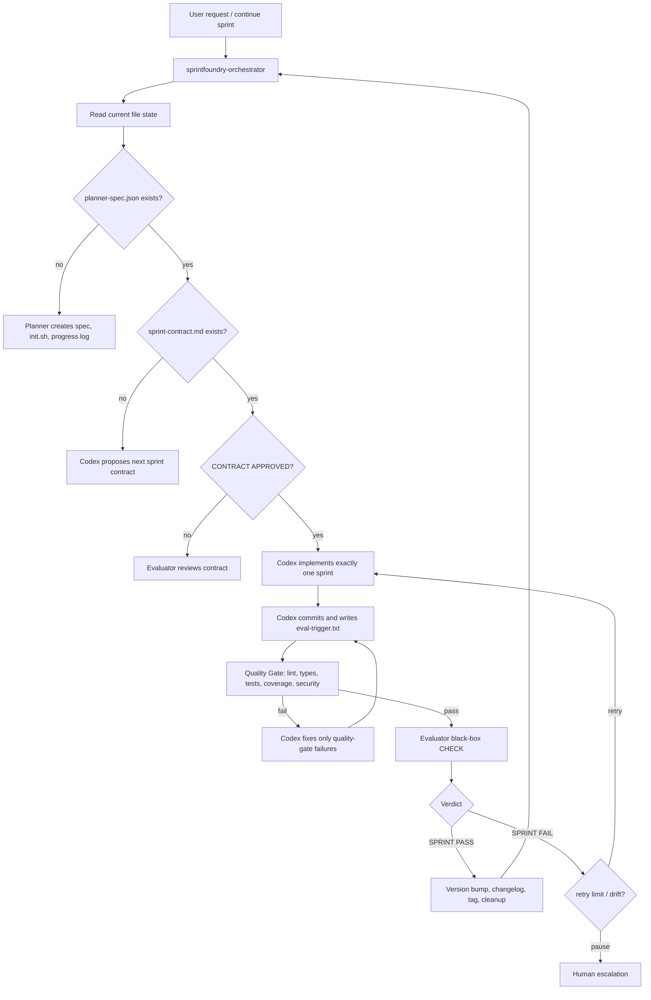

[中文](./README.zh-CN.md) | **English**

# SprintFoundry

SprintFoundry is a Claude Code plugin for AI-driven software delivery. It packages a three-agent sprint harness where Claude plans, routes, and independently evaluates work, while Codex CLI performs the actual implementation.

This repository is now primarily a plugin source and release repository. The canonical runtime entrypoint is the plugin skill:

```text
sprintfoundry-orchestrator
```

The older root-level harness files and scripts remain as development references, tests, and compatibility scaffolding, but published users should consume the complete plugin under `plugins/sprintfoundry`.

## Plugin Architecture

```text
plugins/sprintfoundry/
├── .claude-plugin/
│   └── plugin.json
├── agents/
│   ├── evaluator.md
│   ├── generator.md
│   └── planner.md
└── skills/
    ├── sprintfoundry-orchestrator/
    │   ├── SKILL.md
    │   └── references/
    │       ├── evaluator-agent.md
    │       ├── generator-rules.md
    │       ├── planner-agent.md
    │       ├── protocol.md
    │       ├── quality-gate.md
    │       └── version-updates.md
    ├── harness-branching/
    │   └── SKILL.md
    └── harness-observability/
        ├── SKILL.md
        └── references/
```

Marketplace metadata lives at:

- `.claude-plugin/marketplace.json`
- `plugins/sprintfoundry/.claude-plugin/plugin.json`

The plugin contains:

| Component | Purpose |
| --- | --- |
| `sprintfoundry-orchestrator` skill | Main user-facing coordinator and routing engine |
| `planner` agent | Expands a short request into `planner-spec.json`, `init.sh`, and sprint plan |
| `generator` agent doc | Mirrors the Codex Generator contract for human review; actual implementation runs through Codex CLI |
| `evaluator` agent | Reviews sprint contracts and performs independent black-box verification |
| `harness-branching` skill | One-branch-per-sprint workflow and active branch recovery |
| `harness-observability` skill | Run state, event logs, pause/escalation summaries, and context hygiene |

## Runtime Model

SprintFoundry uses a strict separation of responsibility:

| Role | Runtime | Responsibility |
| --- | --- | --- |
| Planner | Claude sub-agent | Turns a short user request into product direction, verification mode, and sprint plan |
| Generator | Codex CLI | Implements one approved sprint, self-checks, commits, and writes `eval-trigger.txt` |
| Evaluator | Claude sub-agent + verification tools | Reviews contracts and verifies committed work through the configured external surface |
| Orchestrator | `sprintfoundry-orchestrator` skill | Reads file state, chooses the next route, invokes agents, and pauses on unsafe state |

Important boundaries:

- Claude does not write application code.
- Codex does not evaluate its own output.
- Progress advances through file artifacts, not chat memory.
- A sprint is complete only when `.sprintfoundry/eval-results/eval-result-{N}.md` contains `SPRINT PASS`.

## Main Flow



## Verification Modes

The Evaluator is not browser-only. The Planner records the external verification surface in `planner-spec.json`:

```json
{
  "verification": {
    "mode": "browser | api | cli | job | library",
    "base_url": "http://localhost:3000",
    "command": "pytest -q"
  }
}
```

Supported modes:

| Mode | Evaluator surface | Typical evidence |
| --- | --- | --- |
| `browser` | Playwright MCP | Screenshots, visible UI state, user flows |
| `api` | `curl`, `httpx`, OpenAPI/Newman-style checks | HTTP status, JSON bodies, persisted API-visible state |
| `cli` | Shell commands | Exit code, stdout/stderr, generated files |
| `job` | Queue/job endpoints or scripts | Enqueued task, polling status, side effects |
| `library` | External consumer project or sample script | Install/import success and public API output |

This makes SprintFoundry suitable for frontend apps, full-stack apps, API services, CLIs, workers, and libraries.

## File-State Protocol

SprintFoundry is a file-driven state machine. The orchestrator always prefers current files over prior conversation context.

| File | Owner | Purpose |
| --- | --- | --- |
| `planner-spec.json` | Planner | Product spec, design language, tech stack, verification mode, and sprint list |
| `sprint-contract.md` | Generator + Evaluator | Current sprint acceptance contract; code cannot start until approved |
| `sprint-fence.json` | Orchestrator | Expected sprint number and base commit before implementation starts |
| `eval-trigger.txt` | Generator | Signal that a committed sprint is ready for quality gate and evaluation |
| `quality-gate-{N}.md` | Orchestrator | Static quality gate result before Evaluator CHECK |
| `.sprintfoundry/eval-results/eval-result-{N}.md` | Evaluator | Sprint verdict and evidence; only `SPRINT PASS` completes a sprint |
| `run-state.json` | Orchestrator | Current mode, retry counters, active branch, pause state, version metadata |
| `claude-progress.txt` | Generator + Orchestrator | Compact rolling handoff, not a transcript |
| `change-request.md` | User + Orchestrator | Classified iteration request: bugfix, minor feature, major feature, or replan |
| `bug-report.md` | User + Orchestrator | Dedicated regression intake for tightly scoped bugfix sprints |
| `human-escalation.md` | Orchestrator | Current pause reason and recommended human action |

Runtime logs such as `run-state.json`, `.sprintfoundry/`, `eval-result-*.md` legacy files, `quality-gate-*.md`, `VERSION`, and `CHANGELOG.md` are ignored in this repository because they belong to consuming projects.

## Quality Gate

Before the Evaluator performs black-box verification, the orchestrator runs an internal quality gate described in `references/quality-gate.md`.

Depending on the detected stack, it can run:

- lint checks
- type checks
- unit tests
- coverage thresholds
- dependency security audits

Quality gate failures use their own `quality_retry_count`; they do not consume the Evaluator retry budget. The Evaluator reads `quality-gate-{N}.md` and uses it when scoring Craft.

## Versioning

After every `SPRINT PASS`, SprintFoundry can apply an automatic semantic version bump:

- `bugfix` -> patch
- normal feature / minor feature -> minor
- major feature / replan / breaking signal -> major

The flow is defined in `references/version-updates.md` and writes `VERSION`, `CHANGELOG.md`, and a Git tag in the consuming project.

## Publishing

The complete plugin source is committed under `plugins/sprintfoundry`.

Build a distributable plugin archive:

```bash
bash scripts/package_plugin.sh
```

Optionally bump the plugin version first:

```bash
bash scripts/package_plugin.sh --bump patch
bash scripts/package_plugin.sh --bump minor
bash scripts/package_plugin.sh --bump major
```

The script validates plugin structure, keeps plugin and marketplace versions in sync, and writes `sprintfoundry.plugin`. The archive is a local build artifact and is intentionally ignored by Git; publish it through release artifacts rather than committing it.

The CI workflow `.github/workflows/validate-plugins.yml` validates:

- marketplace metadata
- plugin structure
- skills with `SKILL.md`
- agents with Markdown definitions
- version consistency between marketplace and plugin manifests

## Repository Layout

```text
.
├── .claude-plugin/
│   └── marketplace.json
├── .github/
│   └── workflows/
│       └── validate-plugins.yml
├── plugins/
│   └── sprintfoundry/
├── scripts/
│   ├── package_plugin.sh
│   ├── orchestrate.py
│   ├── harness-log.py
│   └── install-hooks.sh
├── examples/
│   ├── bug-report.md
│   ├── change-request.md
│   ├── human-escalation.md
│   └── planner-spec.json
├── tests/
│   └── test_orchestrate.py
├── AGENTS.md
├── CLAUDE.md
├── README.md
└── README.zh-CN.md
```

`scripts/orchestrate.py` remains a useful reference implementation and test target for protocol behavior, but the publishable product is the complete Claude Code plugin.

## Development Checks

```bash
# Validate Python protocol tests
python3 -m pytest -q

# Validate and build the plugin artifact
bash scripts/package_plugin.sh

# Inspect the generated archive
zipinfo -1 sprintfoundry.plugin
```

`sprintfoundry.plugin`, `*.skill`, `.DS_Store`, runtime state files, and temporary packaging directories are ignored by Git.

## Usage In A Target Project

After installing the plugin, invoke `sprintfoundry-orchestrator` from Claude Code when you want to:

- start a new AI-driven project
- continue the next sprint
- resume an interrupted loop
- handle a bug report
- process a change request
- inspect or recover paused unattended state

The skill will read current artifacts, choose the next route, and call the appropriate Planner, Codex Generator, or Evaluator path.
