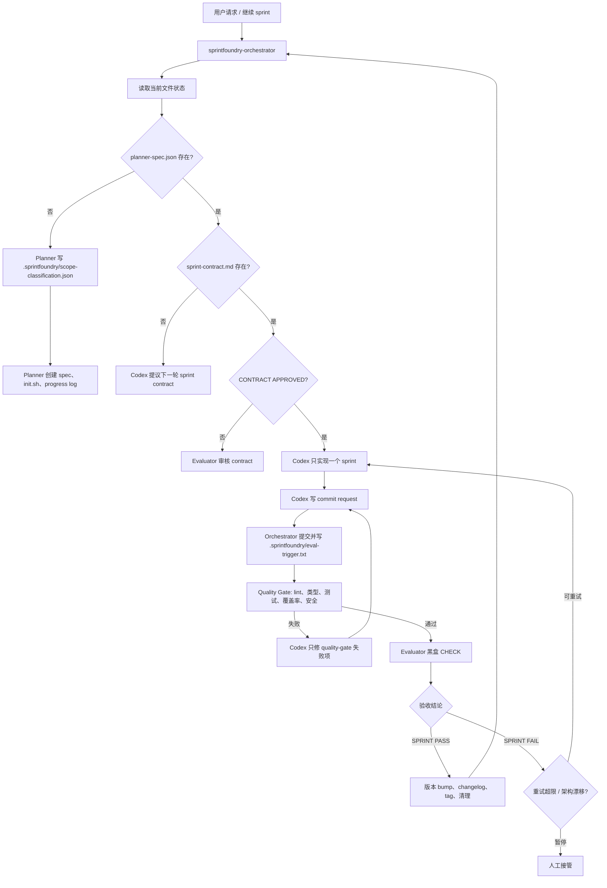

**中文** | [English](./README.md)

# SprintFoundry

SprintFoundry 是一个面向 AI 软件交付的 Claude Code plugin。它封装了一套三代理 sprint harness：Claude 负责规划、路由和独立验收，Codex CLI 负责真实代码实现。

这个仓库现在主要是 plugin 源码与发布仓库。标准运行入口是 plugin skill：

```text
sprintfoundry-orchestrator
```

旧的根目录 harness 文件和脚本继续保留，用于开发参考、测试和兼容；正式发布与安装时，应消费 `plugins/sprintfoundry` 下的完整 plugin。

## Plugin 架构

```text
plugins/sprintfoundry/
├── .claude-plugin/
│   └── plugin.json
├── agents/
│   ├── evaluator.md
│   ├── generator.md
│   └── planner.md
└── skills/
    ├── sprintfoundry-orchestrator/
    │   ├── SKILL.md
    │   └── references/
    │       ├── evaluator-agent.md
    │       ├── generator-rules.md
    │       ├── planner-agent.md
    │       ├── protocol.md
    │       ├── quality-gate.md
    │       └── version-updates.md
    ├── harness-branching/
    │   └── SKILL.md
    └── harness-observability/
        ├── SKILL.md
        └── references/
```

Marketplace 元数据位于：

- `.claude-plugin/marketplace.json`
- `plugins/sprintfoundry/.claude-plugin/plugin.json`

plugin 内包含：

| 组件 | 作用 |
| --- | --- |
| `sprintfoundry-orchestrator` skill | 面向用户的主协调器和路由引擎 |
| `planner` agent | 把短需求扩展成 `planner-spec.json`、`init.sh` 和 sprint 计划 |
| `generator` agent 文档 | 镜像 Codex Generator 契约，便于人工审阅；真实实现仍由 Codex CLI 执行 |
| `evaluator` agent | 审核 sprint contract，并做独立黑盒验证 |
| `harness-branching` skill | 每个 sprint 一条分支，以及 active branch 恢复 |
| `harness-observability` skill | 运行状态、事件日志、暂停/人工接管摘要、上下文清洁 |

## 运行模型

SprintFoundry 有严格的职责边界：

| 角色 | 运行时 | 职责 |
| --- | --- | --- |
| Planner | Claude sub-agent | 先判定项目规模，再将需求转成产品方向、验证模式和 sprint 计划 |
| Generator | Codex CLI | 实现一个已批准 sprint，自检，并写入 commit request |
| Evaluator | Claude sub-agent + 验证工具 | 审核 contract，并通过配置的外部表面验证已提交工作 |
| Orchestrator | `sprintfoundry-orchestrator` skill | 读取文件状态、调用代理、负责 Git commit 和 `.sprintfoundry/eval-trigger.txt`，并在不安全状态下暂停 |

关键边界：

- Claude 不写业务应用代码。
- Codex 不评估自己的输出，也不写 Git 元数据。
- `.sprintfoundry/eval-trigger.txt` 只在 Orchestrator 完成 sprint commit 后写入。
- 进度推进依赖文件产物，而不是聊天记忆。
- sprint 完成的唯一权威信号是 `.sprintfoundry/eval-results/eval-result-{N}.md` 包含 `SPRINT PASS`。

## 主流程



## 规划规模

规划前，SprintFoundry 会写入 `.sprintfoundry/scope-classification.json`，其中包含
`planning_mode`：

| 模式 | 适用场景 | 初始拆解 |
| --- | --- | --- |
| `standard` | MVP、聚焦工具、单一业务域应用 | 12-20 个 features，8-12 个 sprints |
| `large_system` | 大型管理系统、架构设计文档、RBAC、审批、审计、报表、多租户或多组织范围 | 4-10 个 epics，只展开第一个可执行 epic 为 3-8 个初始 sprints |

这样大型系统不会被压缩成过粗的 12 个 sprint，小型项目也仍然保持轻量。

## 验证模式

Evaluator 不再是浏览器专用验收器。Planner 会在 `planner-spec.json` 中记录外部验证表面：

```json
{
  "verification": {
    "mode": "browser | api | cli | job | library",
    "base_url": "http://localhost:3000",
    "command": "pytest -q"
  }
}
```

支持模式：

| 模式 | Evaluator 验证表面 | 典型证据 |
| --- | --- | --- |
| `browser` | Playwright MCP | 截图、可见 UI 状态、用户流程 |
| `api` | `curl`、`httpx`、OpenAPI/Newman 风格检查 | HTTP 状态码、JSON 响应、API 可见持久化状态 |
| `cli` | Shell 命令 | exit code、stdout/stderr、生成文件 |
| `job` | 队列/任务端点或脚本 | 入队任务、轮询状态、副作用 |
| `library` | 外部 consumer 项目或示例脚本 | 安装/导入成功、公开 API 输出 |

因此 SprintFoundry 可以用于前端应用、全栈应用、API 服务、CLI、worker 和 library。

## 文件状态协议

SprintFoundry 是文件驱动状态机。Orchestrator 总是优先相信当前文件，而不是历史聊天上下文。

| 文件 | 所有者 | 用途 |
| --- | --- | --- |
| `.sprintfoundry/scope-classification.json` | Planner | 规模判定：`standard` 或 `large_system`，包含依据和 epic 轮廓 |
| `planner-spec.json` | Planner | 产品规格、视觉语言、技术栈、验证模式和 sprint 列表 |
| `sprint-contract.md` | Generator + Evaluator | 当前 sprint 的验收合同；未批准前不能编码 |
| `.sprintfoundry/sprint-fence.json` | Orchestrator | 实现开始前的预期 sprint 号和 base commit |
| `.sprintfoundry/commit-requests/sprint-{N}.json` | Generator | 请求 Orchestrator 代为提交并创建 trigger |
| `.sprintfoundry/eval-trigger.txt` | Orchestrator | 表示已提交 sprint 等待 quality gate 和评估 |
| `.sprintfoundry/quality-gates/quality-gate-{N}.md` | Orchestrator | Evaluator CHECK 前的静态质量门禁结果 |
| `.sprintfoundry/eval-results/eval-result-{N}.md` | Evaluator | sprint 结论和证据；只有 `SPRINT PASS` 才代表完成 |
| `.sprintfoundry/run-state.json` | Orchestrator | 当前模式、重试计数、活跃分支、暂停状态、版本元数据 |
| `.sprintfoundry/claude-progress.txt` | Generator + Orchestrator | 简洁滚动交接，不是 transcript |
| `change-request.md` | User + Orchestrator | 分类后的迭代请求：bugfix、minor feature、major feature 或 replan |
| `bug-report.md` | User + Orchestrator | 专用于回归缺陷的输入，进入严格受限的 bugfix sprint |
| `human-escalation.md` | Orchestrator | 当前暂停原因和推荐人工动作 |

运行态文件统一放在 `.sprintfoundry/`。旧版根目录 `run-state.json`、`eval-trigger.txt`、`sprint-fence.json`、`eval-result-*.md` 和 `quality-gate-*.md` 可迁移或兼容读取，但新的机器产物不应再写到项目根目录。

## Quality Gate

Evaluator 做黑盒验证前，Orchestrator 会先运行 `references/quality-gate.md` 中定义的内部质量门禁。

根据检测到的技术栈，它可以运行：

- lint 检查
- 类型检查
- 单元测试
- 覆盖率阈值
- 依赖安全审计

Quality Gate 失败使用独立的 `quality_retry_count`，不消耗 Evaluator 的 retry 预算。Evaluator 会读取 `.sprintfoundry/quality-gates/quality-gate-{N}.md`，并将其纳入 Craft 评分。旧版根目录 `quality-gate-{N}.md` 仅迁移兼容读取，新文件统一写入 `.sprintfoundry/quality-gates/`。

## 版本策略

每个 sprint 获得 `SPRINT PASS` 后，SprintFoundry 可以自动执行语义化版本 bump：

- `bugfix` -> patch
- 普通 feature / minor feature -> minor
- major feature / replan / breaking 信号 -> major

流程定义在 `references/version-updates.md` 中，会在消费项目里写入 `VERSION`、`CHANGELOG.md` 和 Git tag。

## 发布

完整 plugin 源码提交在 `plugins/sprintfoundry` 下。

构建可分发 plugin 包：

```bash
bash scripts/package_plugin.sh
```

也可以先 bump plugin 版本：

```bash
bash scripts/package_plugin.sh --bump patch
bash scripts/package_plugin.sh --bump minor
bash scripts/package_plugin.sh --bump major
```

脚本会校验 plugin 结构，同步 plugin manifest 和 marketplace 版本，并写出 `sprintfoundry.plugin`。该归档是本地构建产物，已被 Git 忽略；发布时应通过 release artifact 分发，而不是提交到仓库。

CI 工作流 `.github/workflows/validate-plugins.yml` 会校验：

- marketplace 元数据
- plugin 结构
- 每个 skill 都有 `SKILL.md`
- agents 目录包含 Markdown 定义
- marketplace manifest 与 plugin manifest 版本一致

## 仓库结构

```text
.
├── .claude-plugin/
│   └── marketplace.json
├── .github/
│   └── workflows/
│       └── validate-plugins.yml
├── plugins/
│   └── sprintfoundry/
├── scripts/
│   ├── package_plugin.sh
│   ├── orchestrate.py
│   ├── harness-log.py
│   └── install-hooks.sh
├── examples/
│   ├── bug-report.md
│   ├── change-request.md
│   ├── human-escalation.md
│   └── planner-spec.json
├── tests/
│   └── test_orchestrate.py
├── AGENTS.md
├── CLAUDE.md
├── README.md
└── README.zh-CN.md
```

`scripts/orchestrate.py` 仍然是有用的参考实现和协议测试目标，但可发布产品是完整 Claude Code plugin。

## 开发检查

```bash
# 验证 Python 协议测试
python3 -m pytest -q

# 校验并构建 plugin 产物
bash scripts/package_plugin.sh

# 查看生成的归档内容
zipinfo -1 sprintfoundry.plugin
```

`sprintfoundry.plugin`、`*.skill`、`.DS_Store`、运行态状态文件和临时打包目录均被 Git 忽略。

## 在目标项目中使用

安装 plugin 后，当你需要以下能力时，在 Claude Code 中调用 `sprintfoundry-orchestrator`：

- 启动新的 AI 驱动项目
- 继续下一个 sprint
- 恢复中断的 sprint loop
- 处理 bug report
- 处理 change request
- 检查或恢复已暂停的无人值守状态

该 skill 会读取当前 artifacts，选择下一步路由，并调用对应的 Planner、Codex Generator 或 Evaluator 路径。

SprintFoundry 会在启动时解析明确的 `SPRINTFOUNDRY_PROJECT_ROOT`，所有
Bash、Codex、Planner、Evaluator 工作都从这个项目根目录执行。plugin cache
目录永远不会被当成项目目录，因此多个项目可以同时运行该 plugin，而不会共享
harness 状态。
